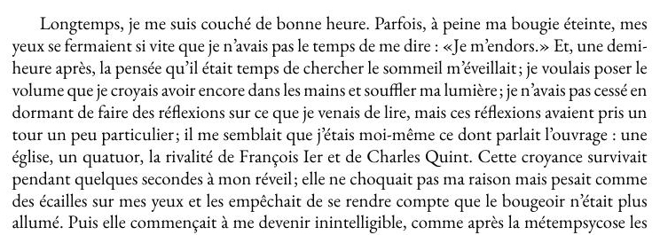
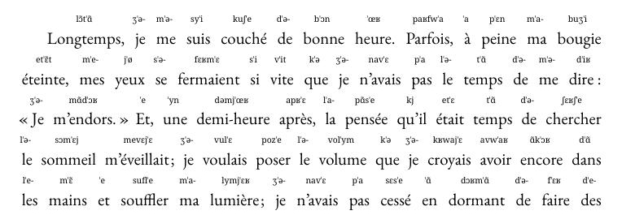

# Protutor - Pronunciation Tutor

Protutor is a simple Python script to convert your favorite book in .tex format to a form, where IPA pronunciations of the words/clauses are displayed above the text. Here's how it looks:

| Original                                                   | With IPA                                                           |
|------------------------------------------------------------|--------------------------------------------------------------------|
| [](examples/du_cote.pdf) | [](examples/du_cote_pro.pdf) |

## Requirements

- Python 3.11;
- The resulting $\LaTeX$ files will probably require XeLaTeX to compile.

## Installation

You can use PIP to install the package:

```shell
pip install "git+https://github.com/vitreusx/protutor"
```

## Usage

See `python -m protutor -h` for help.